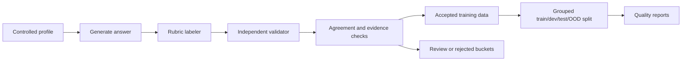

# Junior Interview Answer Scoring

NLP course project by Daniel Shatzov and Shai Gigi.

This repository builds and evaluates a small NLP system for scoring junior developer interview answers. Given a free-text answer about a project experience, the task is to predict six ordinal rubric scores and derived weak/strong aspect labels.

The project is intentionally course-facing: it focuses on task formulation, controlled synthetic data construction, reviewed evaluation data, baseline modeling, error analysis, and final visualizations. It is not intended as a production hiring system.

## Project Motivation

Junior developer interviews often ask candidates to describe a project they worked on. Strong answers usually combine technical detail, personal ownership, clear communication, problem-solving steps, project impact, and relevance to software-development work.

This project turns that qualitative assessment into a measurable NLP task with a fixed rubric, reproducible dataset artifacts, and several baseline models.

## Problem Statement

Input: one free-text answer to a junior developer interview question.

```text
I worked on a small backend API for a course project. Some requests failed because payload validation was inconsistent, so I reproduced the bug locally, checked the logs, and added validation tests. After the fix, the demo requests passed reliably.
```

Output: six scores from `1` to `5`, plus derived weak and strong aspect labels.

```json
{
  "final_scores": {
    "technical_depth": 4,
    "personal_contribution": 4,
    "clarity": 4,
    "problem_solving": 4,
    "impact": 3,
    "role_relevance": 5
  },
  "weak_aspects": [],
  "strong_aspects": [
    "technical_depth",
    "personal_contribution",
    "clarity",
    "problem_solving",
    "role_relevance"
  ]
}
```

## Label Schema

Each answer receives one score per rubric aspect:

| Aspect | Range | Meaning |
| --- | --- | --- |
| `technical_depth` | 1-5 | Concrete implementation detail, debugging, tradeoffs, and meaningful tool use. |
| `personal_contribution` | 1-5 | How clearly the candidate identifies their own work. |
| `clarity` | 1-5 | Organization, coherence, and interview-readiness. |
| `problem_solving` | 1-5 | Challenge, reasoning, steps, and solution quality. |
| `impact` | 1-5 | Outcome, value, delivery, users, metrics, or improvement. |
| `role_relevance` | 1-5 | Relevance to junior software-development work. |

Derived labels:

- `weak_aspects`: aspects with score `<= 2`
- `strong_aspects`: aspects with score `>= 4`

See `docs/label_schema.md` and `docs/rubric.md` for the full label definitions.

## Dataset Summary

The frozen official dataset version is `official_v1`.

| Item | Count |
| --- | ---: |
| Total accepted records | 558 |
| Training split | 265 |
| Project-team reviewed dev split | 64 |
| Project-team reviewed test split | 106 |
| Project-team reviewed OOD split | 55 |
| Final reviewed evaluation records | 225 |
| Duplicate IDs | 0 |
| Duplicate answers | 0 |
| Train/test leakage | 0 |
| OOD/train leakage | 0 |

Training uses `synthetic_interview_data/data/processed/train.jsonl`. Final evaluation uses the reviewed files under `synthetic_interview_data/data/reviewed/`.

## Synthetic Data Methodology

The pipeline uses controlled synthetic generation with label-after-generation scoring:



Labels are assigned from evidence in the generated answer, not copied from sampled target scores. Records with leakage, contradictions, profile mismatch, or large labeler-validator disagreement are routed to review or rejection files instead of silently entering the training split.

## Reviewed Evaluation Files

The original dev/test/OOD files in `data/processed/` are preserved as synthetic review-candidate sources. Final evaluation uses:

| Split | File | Records |
| --- | --- | ---: |
| Dev | `synthetic_interview_data/data/reviewed/dev_project_team_reviewed.jsonl` | 64 |
| Test | `synthetic_interview_data/data/reviewed/test_project_team_reviewed.jsonl` | 106 |
| OOD | `synthetic_interview_data/data/reviewed/ood_project_team_reviewed.jsonl` | 55 |

These labels were reviewed by the project team with the project rubric. They are not external expert annotations.

## Models and Baselines

The repository includes these evaluated baselines:

- Majority baseline
- TF-IDF logistic regression baseline
- Zero-shot LLM baseline
- Few-shot LLM baseline
- Supervised encoder baseline using `distilbert-base-uncased`

The encoder baseline uses only the `answer` text as input and predicts six rubric scores with one shared encoder and one classification head per aspect.

## Training Setup

All supervised models train only on `data/processed/train.jsonl`. Evaluation is run on the project-team reviewed dev/test/OOD files.

The supervised encoder maps scores `1..5` to classes `0..4` internally, then maps predictions back to rubric scores before computing metrics. Labeler, validator, profile, and target fields are not used as model input features.

## Metrics

The main evaluation metrics are:

- Mean exact accuracy across the six rubric aspects
- Per-aspect exact accuracy
- Per-aspect macro-F1 and weighted-F1
- Low/mid/high macro-F1
- Mean absolute error for ordinal scores
- Weak-aspect precision, recall, and F1
- Confusion matrices
- OOD performance drop from reviewed test to reviewed OOD

## Results Summary

The table below uses committed `official_v1` reports only. Test and OOD are the most important final evaluation splits.

| Model | Split | Mean Exact Accuracy | Mean MAE | Weak-Aspect F1 |
| --- | --- | ---: | ---: | ---: |
| Majority | Test | 0.2830 | 1.1384 | 0.4422 |
| Majority | OOD | 0.2242 | 1.9424 | 0.3333 |
| TF-IDF logistic regression | Test | 0.6038 | 0.4182 | 0.7646 |
| TF-IDF logistic regression | OOD | 0.3061 | 0.7848 | 0.8636 |
| Zero-shot LLM | Test | 0.6698 | 0.3318 | 0.8163 |
| Zero-shot LLM | OOD | 0.6121 | 0.4182 | 0.8753 |
| Few-shot LLM | Test | 0.6352 | 0.3664 | 0.8092 |
| Few-shot LLM | OOD | 0.5848 | 0.5121 | 0.8518 |
| Supervised encoder | Test | 0.6777 | 0.3428 | 0.8862 |
| Supervised encoder | OOD | 0.2879 | 0.7152 | 0.8889 |

Detailed result artifacts live in `synthetic_interview_data/data/reports/`.

## Key Findings

- The supervised encoder is competitive on the reviewed test split.
- Zero-shot LLM generalizes better to OOD than the trained encoder in these runs.
- Weak-aspect detection is more stable than exact `1`-to-`5` score prediction.
- The encoder has a large OOD exact-accuracy drop.
- Error analysis suggests many encoder mistakes are ordinal boundary errors rather than catastrophic errors.
- `role_relevance`, `technical_depth`, and `clarity` remain important difficult aspects.
- Evaluation labels are project-team reviewed, not external expert annotations.

These findings should be read as baseline results on a synthetic, project-reviewed dataset, not as evidence of production readiness.

## Error Analysis

The error-analysis stage focuses on existing prediction artifacts, especially the supervised encoder. It summarizes exact-all-aspects rate, severe-error rate, weak-aspect errors, per-aspect signed error patterns, OOD deltas, slice summaries, and top error examples.

Main files:

- `synthetic_interview_data/data/reports/error_analysis_results.json`
- `synthetic_interview_data/data/reports/error_analysis_results.md`

## Visualizations

Final figures and small tables are generated under `synthetic_interview_data/data/visuals/`.

| File | Purpose |
| --- | --- |
| `model_comparison_mean_exact.png` | Compare mean exact accuracy by model and split. |
| `model_comparison_mae.png` | Compare ordinal mean absolute error by model and split. |
| `weak_aspect_f1_by_model.png` | Compare weak-aspect detection F1 by model and split. |
| `ood_drop_by_model.png` | Show test-to-OOD metric deltas by model. |
| `encoder_per_aspect_errors.png` | Show encoder per-aspect error patterns. |
| `dataset_split_counts.png` | Show official train/dev/test/OOD split sizes. |
| `visuals_summary.md` | Human-readable index of generated visuals. |
| `visuals_manifest.json` | Machine-readable manifest of generated visual artifacts. |

## Repository Structure

```text
NLP_Course/
├── README.md
├── docs/
│   ├── label_schema.md
│   └── rubric.md
├── sources/
│   └── course reference materials
└── synthetic_interview_data/
    ├── README.md
    ├── config/
    ├── data/
    │   ├── processed/
    │   ├── reviewed/
    │   ├── reports/
    │   └── visuals/
    ├── scripts/
    ├── src/
    └── tests/
```

Use this root README for the project overview. Use `synthetic_interview_data/README.md` as the technical guide for scripts, data layout, and implementation details.

## How To Run Key Scripts

From the repository root:

```bash
cd synthetic_interview_data
pip install -r requirements.txt
```

Run tests:

```bash
python3 -m unittest discover -s tests -v
```

Run classical baselines:

```bash
python3 scripts/run_baselines.py
```

Run LLM baseline plumbing without API calls:

```bash
python3 scripts/run_llm_baselines.py --mode all --splits dev --dry-run --limit 5 --output-dir /private/tmp/llm_baseline_smoke
```

Run a small encoder smoke test:

```bash
python3 scripts/run_encoder_baseline.py --model-name distilbert-base-uncased --epochs 1 --batch-size 4 --limit-train 20 --limit-eval 10 --output-dir /tmp/encoder_baseline_smoke
```

Run reproducible error analysis:

```bash
python3 scripts/run_error_analysis.py --output-dir data/reports --top-n-examples 20
```

Generate final visuals from existing reports:

```bash
python3 scripts/make_final_visuals.py --output-dir data/visuals --format png
```

Real LLM runs, full encoder training runs, and full dataset regeneration are intentionally not part of routine cleanup or review. They can overwrite or regenerate expensive artifacts and should be run only deliberately.

## Limitations

- The dataset is synthetic and may contain generation-style bias.
- Rubric scores are subjective even with a detailed schema.
- Reviewed evaluation labels are project-team reviewed, not external expert annotation.
- OOD coverage is useful for stress testing, but it is still limited in size.
- The supervised encoder is a baseline, not a final deployable model.
- Results should be interpreted as course-project evidence, not as a hiring decision system.

## Team Members

- Daniel Shatzov
- Shai Gigi
