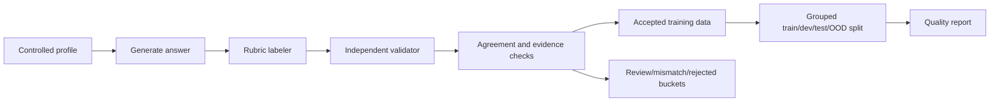

# Junior Interview Answer Scoring

This is an NLP/LLM course project about evaluating junior developer interview answers to project-experience questions.

The project turns a free-text candidate answer into six rubric-based quality scores, plus weak/strong aspect labels and validation metadata. The current work focuses on building a controlled synthetic dataset that is reliable enough for baseline training and defensible as an academic NLP project.

## Project Task

Input:

```text
I worked on a small backend API for a course project. Some requests failed because payload validation was inconsistent, so I reproduced the bug locally, checked the logs, and added validation tests. After the fix, the demo requests passed reliably.
```

Output:

| Aspect | Range | Meaning |
| --- | --- | --- |
| `technical_depth` | 1-5 | Technical detail, implementation, debugging, tradeoffs, and meaningful tool use. |
| `personal_contribution` | 1-5 | How clearly the candidate explains their own work. |
| `clarity` | 1-5 | Organization, coherence, and interview-readiness. |
| `problem_solving` | 1-5 | Challenge, reasoning, steps, and solution quality. |
| `impact` | 1-5 | Project-level outcome, user/team value, metrics, or delivery. |
| `role_relevance` | 1-5 | Relevance to junior software-development work. |

Derived outputs:

- `weak_aspects`: aspects with score `<= 2`
- `strong_aspects`: aspects with score `>= 4`
- validation metadata, labeler evidence, and validator evidence

## Why This Is An NLP Project

The project is not just an app demo. It is a small NLP/ML experiment with:

- a defined input/output task
- an ordinal multi-aspect label schema
- controlled synthetic data generation
- label-after-generation scoring
- independent validation and filtering
- train/dev/test/OOD separation
- quality reporting and error analysis
- planned model comparison

The novelty is not a new neural architecture. The novelty is the task formulation, controlled data methodology, label schema, validation process, and evaluation design.

## Current Repository Structure

```text
NLP_Course/
├── README.md
├── docs/
│   ├── label_schema.md
│   ├── project_source_of_truth.md
│   └── rubric.md
├── sources/
│   └── course/reference materials
└── synthetic_interview_data/
    ├── README.md
    ├── PROJECT_STRUCTURE.md
    ├── config/
    ├── data/
    ├── notebooks/
    ├── scripts/
    ├── src/
    └── tests/
```

## Should `synthetic_interview_data/` Stay?

Yes, for now.

The working implementation is currently a self-contained data pipeline package. It has its own `src/`, `config/`, `tests/`, `scripts/`, and `data/` folders. Moving those folders to the repository root would require import/path updates and test changes, but it would not improve the ML methodology right now.

Recommended structure decision:

- Keep `synthetic_interview_data/` while finishing dataset generation and baseline training.
- Use this root README as the project overview for GitHub/course readers.
- Use `synthetic_interview_data/README.md` as the technical guide for running the data pipeline.
- Revisit a full root-level package redesign only after training/evaluation code is added.

This avoids risky refactoring before the baseline stage while still making the project understandable from the root.

## Dataset Status

Current official dataset version: `official_v1`.

Summary from the latest accepted dataset:

| Item | Count |
| --- | ---: |
| Total accepted records | 558 |
| Train | 265 |
| Dev review candidates | 64 |
| Test review candidates | 107 |
| OOD review candidates | 55 |
| Not selected | 67 |
| Duplicate IDs | 0 |
| Duplicate answers | 0 |
| Train/test leakage | 0 |
| OOD/train leakage | 0 |
| Accepted labeler-validator delta `>= 2` | 0 |

The train split is ready for baseline synthetic training. The original dev/test/OOD splits are synthetic review candidates. For final evaluation, use the project-team reviewed files under `synthetic_interview_data/data/reviewed/`. These files were checked using the project rubric, with unsupported labels corrected and one near-duplicate example excluded. They are project-level reviewed evaluation sets, not external expert annotations.

### Reviewed Evaluation Files

The original dev/test/OOD files under `synthetic_interview_data/data/processed/` are preserved as synthetic review-candidate sources. Final evaluation should use:

- `synthetic_interview_data/data/reviewed/dev_project_team_reviewed.jsonl` (`64` records)
- `synthetic_interview_data/data/reviewed/test_project_team_reviewed.jsonl` (`106` records)
- `synthetic_interview_data/data/reviewed/ood_project_team_reviewed.jsonl` (`55` records)

The final reviewed evaluation size is `225`. These files are project-team reviewed, rubric-based evaluation sets, not external expert annotations. One near-duplicate test candidate was excluded from final evaluation.

### Current Next Step: Baseline Experiments

`official_v1` is frozen for baseline work: use `train.jsonl` for training and the reviewed dev/test/OOD files for evaluation. The next project stage is baseline/model comparison, including majority, rule-based, TF-IDF/classical ML, zero-shot LLM, few-shot LLM, and supervised encoder baselines.

Recommended metrics are exact score accuracy per aspect, low/mid/high macro-F1, ordinal MAE, weak-aspect precision/recall/F1, confusion matrices, OOD performance drop, and qualitative error analysis.

## Data Methodology

The pipeline uses label-after-generation:



Important principle:

Labels are based on evidence in the generated answer, not copied from sampled target scores. If a generated answer fails its intended profile, the pipeline marks it as review/profile-mismatch/rejected instead of forcing the label.

## Main Commands

Run from the data-pipeline package:

```bash
cd synthetic_interview_data
```

Run tests:

```bash
python3 -m unittest discover -s tests -v
```

Run a cheap mock build:

```bash
python3 scripts/build_official_dataset.py \
  --mode mock \
  --output-root /tmp/official_dataset_mock \
  --force \
  --run-tests
```

Run the full OpenAI dataset build:

```bash
python3 scripts/build_official_dataset.py \
  --mode openai \
  --model gpt-5.4-mini \
  --output-root data \
  --force
```

The build script already sets these defaults for OpenAI subprocesses unless you override them:

```text
OPENAI_TIMEOUT_SECONDS=180
OPENAI_MAX_RETRIES=2
```

## Important Files

| Path | Purpose |
| --- | --- |
| `docs/project_source_of_truth.md` | Course/project requirements and methodology checklist. |
| `docs/label_schema.md` | Label schema explanation. |
| `docs/rubric.md` | Rubric details. |
| `synthetic_interview_data/README.md` | Technical data-pipeline guide. |
| `synthetic_interview_data/scripts/build_official_dataset.py` | Reproducible dataset build script. |
| `synthetic_interview_data/src/main_generate.py` | Main generation CLI. |
| `synthetic_interview_data/src/labeler.py` | Rubric labeler. |
| `synthetic_interview_data/src/validator.py` | Independent validator and routing logic. |
| `synthetic_interview_data/src/merge_datasets.py` | Merge, balance, split, and leakage-safe export. |
| `synthetic_interview_data/data/reviewed/*_project_team_reviewed.jsonl` | Project-team reviewed dev/test/OOD evaluation files. |
| `synthetic_interview_data/data/reviewed/manual_review_audit.jsonl` | Audit trail for confirmed, corrected, and excluded evaluation candidates. |
