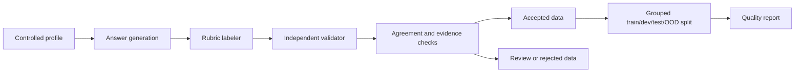

# Synthetic Interview Data Pipeline

This folder contains the working synthetic-data pipeline for the junior interview answer scoring project.

For the full project overview, start with the root [README.md](../README.md). This README is the technical guide for generating, validating, splitting, and reporting the synthetic dataset.

The task is to convert a free-text interview answer into a structured quality assessment across six rubric aspects. This package focuses on controlled synthetic data generation, label-after-generation scoring, validation, and baseline-ready dataset construction.

> **Current project status:** `official_v1` is frozen. Classical, LLM, supervised encoder, error-analysis, and visualization artifacts are committed, and final evaluation uses the project-team reviewed dev/test/OOD files under `data/reviewed/`.

---

## 1. Motivation

Junior developer interviews often include questions such as:

> “Tell me about a project you worked on.”

Strong answers usually show concrete technical work, personal ownership, clear explanation, problem solving, impact, and relevance to software-development roles. Weak answers may be vague, passive, poorly structured, or unrelated to real implementation work.

The goal of this project is to model that evaluation process as a measurable NLP task.

This project does **not** claim to introduce a new model architecture. The novelty is in the task formulation and dataset construction: a fine-grained scoring schema for junior project-experience answers, generated through controlled synthetic profiles and validated after generation.

---

## 2. Problem Statement

### Input

A candidate’s free-text answer to a junior developer interview question about a project.

Example:

```text
I worked on a small backend API for a course project. Some requests failed because payload validation was inconsistent, so I reproduced the bug locally, checked the logs, and added validation tests. After the fix, the demo requests passed reliably.
```

### Output

A structured label object containing six ordinal scores from `1` to `5`:

| Aspect | Meaning |
| --- | --- |
| `technical_depth` | Concrete technical work, implementation detail, debugging, tradeoffs, or meaningful tool use. |
| `personal_contribution` | How clearly the candidate’s own work is separated from team or passive descriptions. |
| `clarity` | Organization, coherence, and ease of understanding. |
| `problem_solving` | Description of a challenge and concrete steps toward a solution. |
| `impact` | Evidence of outcome, value, delivery, users, metrics, or improvement. |
| `role_relevance` | Relevance to junior software-development work. |

Derived labels:

- `weak_aspects`: all aspects with score `<= 2`
- `strong_aspects`: all aspects with score `>= 4`

---

## 3. Dataset Version

The current official dataset version is `official_v1`.

| Item | Count |
| --- | ---: |
| Total accepted records | 558 |
| Train | 265 |
| Dev review candidates | 64 |
| Test review candidates | 107 |
| OOD review candidates | 55 |
| Not selected | 67 |
| Duplicate IDs | 0 |
| Duplicate answers | 0 |
| Train/test leakage | 0 |
| OOD/train leakage | 0 |
| Accepted labeler-validator delta `>= 2` | 0 |

### Score coverage

Scores are grouped as low `1–2`, mid `3`, and high `4–5`.

| Aspect | Low | Mid | High |
| --- | ---: | ---: | ---: |
| `technical_depth` | 236 | 134 | 188 |
| `personal_contribution` | 269 | 44 | 245 |
| `clarity` | 44 | 97 | 417 |
| `problem_solving` | 279 | 93 | 186 |
| `impact` | 409 | 50 | 99 |
| `role_relevance` | 137 | 75 | 346 |

### Generation sources

| Source | Purpose | Clean accepted |
| --- | --- | ---: |
| `broad` | Normal mixed junior answers | 270 |
| `weak_patch` | Targeted weak-label coverage | 175 |
| `strong_patch` | High-quality patch attempt | 40 |
| `high_impact_patch` | High-impact coverage repair | 35 |
| `diversity_patch` | Missing and rare label coverage repair | 38 |

---

## 4. Methodology

The main design decision is **label-after-generation**: the answer is generated first, and labels are assigned only from evidence visible in the generated text. This avoids directly copying requested target scores into the final labels.



Pipeline steps:

1. Sample a controlled candidate/project profile.
2. Generate a natural junior interview answer.
3. Score the answer using a rubric-based LLM labeler.
4. Independently rescore the same answer using a validator.
5. Reject or flag records with leakage, contradictions, profile mismatch, or large score disagreement.
6. Export accepted records and review buckets.
7. Create grouped train/dev/test/OOD splits.
8. Generate a quality report with dataset statistics and validation checks.

---

## 5. Data Layout

```text
data/
  raw/
    full_synthetic_all.jsonl
    generated/
      broad/
      weak_patch/
      strong_patch/
      high_impact_patch/
  processed/
    train.jsonl
    dev_review_candidates.jsonl
    test_review_candidates.jsonl
    ood_test_review_candidates.jsonl
    not_selected.jsonl
    full_synthetic_clean_accepted.jsonl
    full_synthetic_borderline_review.jsonl
    full_synthetic_manual_review.jsonl
    full_synthetic_profile_mismatch.jsonl
    full_synthetic_rejected.jsonl
  reviewed/
    dev_human_reviewed.jsonl
    test_human_reviewed.jsonl
    ood_test_human_reviewed.jsonl
    dev_project_team_reviewed.jsonl
    test_project_team_reviewed.jsonl
    ood_project_team_reviewed.jsonl
    manual_review_audit.jsonl
    manual_review_summary.md
    manual_review_summary.json
    manual_review_sheet.csv
  reports/
    data_quality.md
    data_quality.json
    manual_review_quality.md
    manual_review_quality.json
    baseline_results.md
    baseline_results.json
    llm_baseline_results.md
    llm_baseline_results.json
    encoder_baseline_results.md
    encoder_baseline_results.json
    error_analysis_results.md
    error_analysis_results.json
  visuals/
    visuals_summary.md
    visuals_manifest.json
```

Important files:

| File | Use |
| --- | --- |
| `data/processed/train.jsonl` | Main synthetic training split. |
| `data/processed/dev_review_candidates.jsonl` | Original synthetic dev review-candidate split, preserved for traceability. |
| `data/processed/test_review_candidates.jsonl` | Original synthetic test review-candidate split, preserved for traceability. |
| `data/processed/ood_test_review_candidates.jsonl` | Original synthetic OOD review-candidate split, preserved for traceability. |
| `data/reviewed/dev_project_team_reviewed.jsonl` | Project-team reviewed dev evaluation split. |
| `data/reviewed/test_project_team_reviewed.jsonl` | Project-team reviewed test evaluation split. |
| `data/reviewed/ood_project_team_reviewed.jsonl` | Project-team reviewed OOD evaluation split. |
| `data/reviewed/manual_review_audit.jsonl` | Project-team review audit trail for confirmed, corrected, and excluded candidates. |
| `data/raw/full_synthetic_all.jsonl` | Merged official records before final processed exports. |
| `data/reports/data_quality.md` | Human-readable dataset quality report. |
| `data/reports/data_quality.json` | Machine-readable dataset quality report. |
| `data/reports/manual_review_quality.md` | Human-readable quality report for reviewed evaluation files. |
| `data/reports/manual_review_quality.json` | Machine-readable quality report for reviewed evaluation files. |
| `data/reports/baseline_results.md` | Majority and TF-IDF logistic regression baseline results. |
| `data/reports/llm_baseline_results.md` | Zero-shot and few-shot LLM baseline results. |
| `data/reports/encoder_baseline_results.md` | Supervised encoder baseline results. |
| `data/reports/error_analysis_results.md` | Reproducible error-analysis report. |
| `data/visuals/visuals_summary.md` | Index of final visualization artifacts. |

---

## 6. Example Record

```json
{
  "example_id": "ex_000123",
  "dataset_version": "official_v1",
  "target_role": "Junior Software Developer",
  "question_type": "debugging_story",
  "project_domain": "backend API",
  "question": "Describe a project where you had to debug a difficult issue.",
  "profile": {
    "profile_id": "technical_but_unstructured",
    "technical_detail": "high",
    "ownership_level": "clear_personal_task",
    "outcome_strength": "limited"
  },
  "answer": "I worked on...",
  "labeler": {
    "scores": {
      "technical_depth": 4,
      "personal_contribution": 3,
      "clarity": 2,
      "problem_solving": 4,
      "impact": 2,
      "role_relevance": 4
    },
    "evidence": {
      "technical_depth": ["checked logs", "reproduced the issue locally"]
    }
  },
  "validator": {
    "scores": {
      "technical_depth": 4,
      "personal_contribution": 3,
      "clarity": 3,
      "problem_solving": 4,
      "impact": 2,
      "role_relevance": 4
    },
    "score_deltas": {
      "technical_depth": 0,
      "personal_contribution": 0,
      "clarity": 1,
      "problem_solving": 0,
      "impact": 0,
      "role_relevance": 0
    }
  },
  "final_scores": {
    "technical_depth": 4,
    "personal_contribution": 3,
    "clarity": 2,
    "problem_solving": 4,
    "impact": 2,
    "role_relevance": 4
  },
  "weak_aspects": ["clarity", "impact"],
  "strong_aspects": ["technical_depth", "problem_solving", "role_relevance"],
  "validation": {
    "final_status": "accepted",
    "rejection_reasons": [],
    "flags": []
  },
  "split": "train"
}
```

---

## 7. Setup

Install dependencies:

```bash
python3 -m pip install -r requirements.txt
```

Run tests:

```bash
python3 -m unittest discover -s tests -v
```

## Baseline Experiments

Run initial baselines:

```bash
cd synthetic_interview_data
python3 scripts/run_baselines.py
```

This evaluates majority and TF-IDF logistic regression baselines on the project-team reviewed dev/test/OOD files.

## LLM Baselines

Run zero-shot and few-shot LLM baseline plumbing in dry-run mode. Write smoke outputs outside the repository so they cannot overwrite committed real results:

```bash
cd synthetic_interview_data
python3 scripts/run_llm_baselines.py \
  --mode all \
  --splits dev \
  --dry-run \
  --limit 5 \
  --output-dir /private/tmp/llm_baseline_smoke
```

Run a small real API smoke test intentionally:

```bash
python3 scripts/run_llm_baselines.py \
  --mode all \
  --splits dev \
  --limit 5 \
  --model gpt-5.4-mini \
  --output-dir /private/tmp/llm_baseline_real_smoke
```

Real LLM runs require `OPENAI_API_KEY` and may cost money. Full real evaluations over dev/test/OOD require `--confirm-cost`; overwriting existing LLM report files requires `--force`. The current real LLM baseline artifacts are kept under `data/reports/llm_baseline_results.json` and `data/reports/llm_baseline_results.md`. Supervised encoder, error-analysis, and final visualization artifacts are also committed under `data/reports/` and `data/visuals/`.

## Supervised Encoder Baseline

Run a small supervised encoder smoke test:

```bash
cd synthetic_interview_data
python3 scripts/run_encoder_baseline.py \
  --model-name distilbert-base-uncased \
  --epochs 1 \
  --batch-size 4 \
  --limit-train 20 \
  --limit-eval 10 \
  --output-dir /tmp/encoder_baseline_smoke
```

## Error Analysis

Run the reproducible error-analysis report over existing baseline artifacts:

```bash
cd synthetic_interview_data
python3 scripts/run_error_analysis.py \
  --output-dir data/reports \
  --top-n-examples 20
```

## Final Visualizations

Generate course-ready figures and summary tables from existing reports:

```bash
cd synthetic_interview_data
python3 scripts/make_final_visuals.py \
  --output-dir data/visuals \
  --format png
```

Run a cheap mock build:

```bash
python3 scripts/build_official_dataset.py \
  --mode mock \
  --output-root /tmp/official_dataset_mock \
  --force \
  --run-tests
```

Run the full OpenAI build:

```bash
python3 scripts/build_official_dataset.py \
  --mode openai \
  --model gpt-5.4-mini \
  --output-root data \
  --force
```

The build script applies these subprocess defaults unless already set:

```text
OPENAI_TIMEOUT_SECONDS=180
OPENAI_MAX_RETRIES=2
```

For manual phase-by-phase generation commands, see the implementation scripts or project notes. The recommended reproducible entry point is `scripts/build_official_dataset.py`.

---

## 8. Code Guide

| File | Purpose |
| --- | --- |
| `scripts/build_official_dataset.py` | Reproducible end-to-end official dataset build. |
| `src/main_generate.py` | Main CLI and orchestration for generation modes. |
| `src/generator.py` | Prompt construction and answer generation behavior. |
| `src/labeler.py` | Rubric-based scoring pass. |
| `src/validator.py` | Independent rescoring, validation statuses, and contradiction checks. |
| `src/targeted_generation.py` | Weak, strong, and high-impact profile builders. |
| `src/merge_datasets.py` | Merge, deduplication, balancing, splitting, and leakage-safe export. |
| `src/quality_report.py` | Dataset quality report generation. |
| `config/profiles.yaml` | Controlled profile definitions. |
| `config/rubrics.yaml` | Scoring rubric configuration. |

---

## 9. Validation Rules

Accepted examples must satisfy the following checks:

- all six final scores exist and are integers from `1` to `5`
- labeler and validator agree within tolerance
- no accepted score delta is `>= 2`
- no label leakage in the answer text
- no evidence contradiction, such as low ownership combined with concrete first-person implementation actions
- `weak_aspects` and `strong_aspects` match the final scores
- train/test scenario leakage is zero
- OOD groups are absent from train

Records that fail these checks are routed to review, profile mismatch, audit, or rejection files instead of silently entering the training split.

---

## 10. Training and Evaluation Readiness

Ready to use now:

| File | Status |
| --- | --- |
| `data/processed/train.jsonl` | Usable for baseline synthetic training. |
| `data/reviewed/dev_project_team_reviewed.jsonl` | Project-team reviewed dev evaluation split. |
| `data/reviewed/test_project_team_reviewed.jsonl` | Project-team reviewed test evaluation split. |
| `data/reviewed/ood_project_team_reviewed.jsonl` | Project-team reviewed OOD evaluation split. |
| `data/reports/data_quality.md` | Usable for methodology and dataset-quality discussion. |
| `data/reports/data_quality.json` | Usable for programmatic checks. |
| `data/reports/manual_review_quality.md` | Usable for reviewed evaluation quality discussion. |
| `data/reports/manual_review_quality.json` | Usable for programmatic reviewed-evaluation checks. |
| `data/reports/baseline_results.md` | Majority and TF-IDF baseline results. |
| `data/reports/llm_baseline_results.md` | Zero-shot and few-shot LLM baseline results. |
| `data/reports/encoder_baseline_results.md` | Supervised encoder baseline results. |
| `data/reports/error_analysis_results.md` | Error-analysis findings and top examples. |
| `data/visuals/visuals_summary.md` | Summary of final generated figures and tables. |

Original review-candidate files:

| File | Current role |
| --- | --- |
| `data/processed/dev_review_candidates.jsonl` | Synthetic pre-review source for the reviewed dev split. |
| `data/processed/test_review_candidates.jsonl` | Synthetic pre-review source for the reviewed test split. |
| `data/processed/ood_test_review_candidates.jsonl` | Synthetic pre-review source for the reviewed OOD split. |

The original dev/test/OOD files under `data/processed/` are synthetic review candidates and are preserved for traceability. For final evaluation, use the project-team reviewed files under `data/reviewed/`. These reviewed files were checked with the project rubric; unsupported impact labels were corrected and one near-duplicate example was excluded. They are project-level reviewed evaluation sets, not external expert annotations.

Recommended evaluation metrics:

- exact score accuracy per aspect
- low/mid/high band accuracy per aspect
- macro-F1 and weighted-F1 for score bands
- weak-aspect detection precision, recall, and F1
- mean absolute error for ordinal scores
- confusion matrices per aspect
- error analysis by project domain, question type, answer length, and profile family

---

## 11. Known Limitations

- The dataset is synthetic, so answers may contain generation-style bias.
- Scores from `1` to `5` are subjective even with a detailed rubric.
- The `impact` aspect is skewed toward low scores, although high-impact coverage was improved for baseline training.
- Low clarity and low role-relevance cases are still less common than high clarity and relevance cases, even though they are represented in `official_v1`.
- Original dev/test/OOD files are synthetic review candidates; final evaluation should use the project-team reviewed files under `data/reviewed/`.
- Results from supervised models should be presented as baseline findings on project-team reviewed evaluation data, not as claims from external expert annotation.

---
